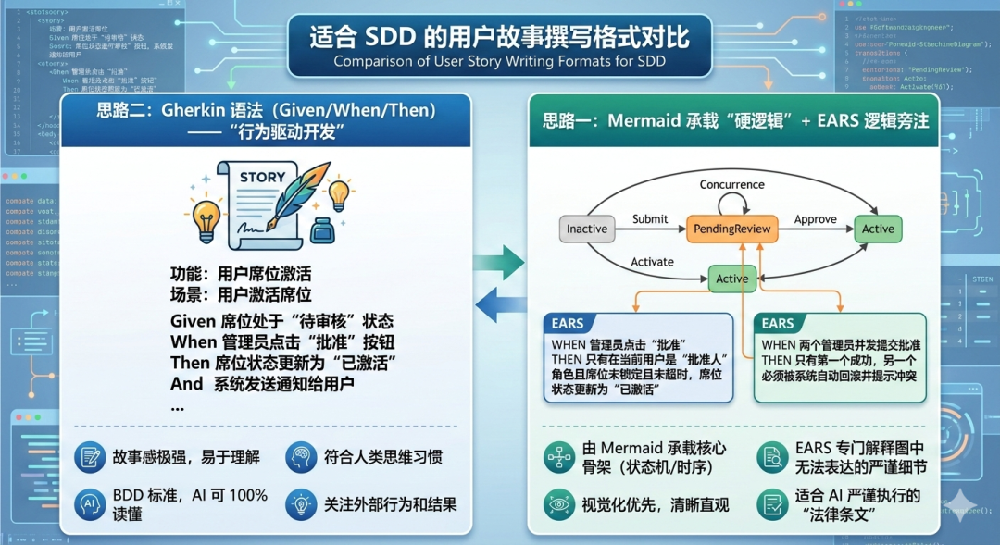

# SDD来了，产品经理如何写AI易读的SPEC(II)-EARS之外还有Gherkin

**点击蓝字关注**  

SDD第二篇来了，EARS以外还有别的吗？

最近 AI 辅助编程很火，说实话，单兵作战的时候写个小工具 不需要持续迭代的时候，这种氛围感确实能骗过自己的大脑，获得抽卡的多巴胺快感；但一旦你尝试在规模化团队里推行 SDD，引入 AI 协作，你会发现这种模糊性就是所有灾难的源头。

AI 辅助编程的上限，从来不在于大模型的智商，而在于你给出的 Spec 是否足够清晰。

**产品经理，你准备好了吗？**  

没有的话，开发同学就只能自己撸袖子，充当那个从墨刀原型到AI可读spec的翻译官了。但这个翻译后的语义，是你想要的吗？

那怎么才能有一个团队共识的spec，作为工程化、可持续迭代，多方协作的基准？

## **PART 01**  
**回顾EARS**  
[ 点击这里](https://mp.weixin.qq.com/s?__biz=MzI0MjA0MjM4Ng==&mid=2647648289&idx=1&sn=e38dee841094aade2bb5b25d610795f1&scene=21#wechat_redirect)查看上一篇关于EARS的分享

说实话分开看，EARS（ _While... When..._ ）每条都没什么毛病，但连起来真正落地时，是有点拗口的，如果场景较为复杂，更像是读一本法律宝典了，读过了，也就度过了。

EARS直接写在 MD 里虽然逻辑严密，但读起来的这种法律条文感如果本身系统是强逻辑弱场景的，比如策略引擎这种甚至连交互界面都很少的case，是容易代入和适用。

如果是交互比较多、业务操作步骤较多的系统，EARS的适用度有一定的局限性，废了不少脑细胞写了半部民法典，可能大模型看得懂，开发同学和测试同学读起来表示非常痛苦。

所以我在思考，还有没有对于产品同学、开发同学、测试同学都更加友好的框架？除了AI易读，也要考虑到人类易读性，毕竟最后需要确认把关的还是要回到项目团队的每个人身上。

“如果说 EARS 是为了保证系统的‘不倒翁’体质(是让AI清晰阅读SPEC我们想到的第一个法宝），如何能更直观描述这个‘不倒翁’与人(用户)共舞的过程。  

那么，我又找来了一个好东西跟大家分享----**Gherkin** 语法。

## **PART 02**  
**老规矩，先回答什么是Gherkin**  

什么是Gherkin，Gherkin直译小黄瓜。

Gherkin是BDD（行为驱动开发）的标准，它比 EARS 更像是在讲故事，格式如下：

> **场景** ：用户激活席位****
> 
> **Given** 席位处于“待审核”状态****
> 
> **When** 管理员点击“批准”****
> 
> **Then** 席位状态更新为“已激活”****
> 
> **And** 系统发送通知给用户

  - **优点** ：这种“故事感”极强，AI 依然能 100% 读懂，且更符合人类的思维习惯。

比起来EARS的法律条款既视感，它跟我们产品经理熟知的user story的标准格式更接近。

不同的是，标准**User Story ( As a... I want... So that...)**描述的是“意图”和“商业价值”**，而****Gherkin (**Given... When... Then...**)**描述的是“实现路径”和“验收标准”。

当然在 SDD 模式下，User Story 是 Gherkin(乃至EARS) 的**标题/前提** 。

我们举一个例子来看二者的映射关系。

User Story (意图定义)

> **As a** 销售人员,**I want to** 在客户活跃时收到实时通知,**So that** 我能抓住黄金 5 分钟进行回访，提高线索转化率。

Gherkin Mapping 会表述成这样(逻辑实现)，是不是一个像文科生，一个像理科生。

>   - **Feature** : 实时线索预警
> 
>   - **Scenario** : 客户官网活跃触发销售通知 (对齐 Story 中的 I want to)
> 
>     - **Given** 我是该线索的负责人 (对齐 As a)
> 
>     - **And** 该线索在系统中处于“跟进中”状态
> 
>     - **When** 客户在官网上点击了“预约演示” (细化 I want to 的动作)
> 
>     - **Then** 我应当在 10 秒内收到手机 App 的弹窗提醒 (对齐 So that 的价值实现)
> 
>     - **And** 系统应当在我的“待办事项”中新增一条跟进任务。
> 
> 
  
**历史小故事，为什么叫“小黄瓜” (Gherkin)？**

这要追溯到它的起源工具——**Cucumber** （黄瓜）。

  - **生态命名法** ：在 2008 年左右，Ruby 社区的大佬 Aslak Hellesøy 开发了一个行为驱动开发（BDD）的测试框架，起名叫 **Cucumber** 。为了让这个框架能读懂人类的自然语言，他设计了一套特定语法的领域专用语言（DSL），并顺着“黄瓜”这个植物主题，给这套语言起名为 **Gherkin** （意为“小黄瓜”或“酸黄瓜”）。

  - **软件界的“食物系”传统** ：就像 Java 叫咖啡、安卓版本叫甜点一样，BDD 社区当时流行植物/食物命名。这种命名方式能降低技术门槛，让“需求”听起来不那么冷冰冰，更像是一种“生长”出来的共识。

## **PART 03**  
**用Gherkin把上篇EARS改写一遍**  

EARS那篇中，我们举了几个关于线索的案例，同样的我们把相同的case用gherkin代入感受一下

### **事件驱动 (Event-driven)**  

**原 EARS** : 当用户在 APP 点击领取优惠券时，线索应当被创建。

- **Gherkin 转化** : 强调“点击”这一瞬间的原子动作。
- **Scenario** : 用户领取优惠券触发线索创建
- **Given** 用户浏览 APP 的活动页面
- **When** 用户点击“领取优惠券”按钮
- **Then** 系统应当自动在后台创建一条对应的营销线索
- **And** 该线索的来源应标记为“APP优惠券领取”

### **状态驱动 (State-driven)**  

**原 EARS** : 当线索未及时跟进即将回流时，系统应当通知线索责任人发送提醒。

- **Gherkin 转化** : 强调“状态持续”或“临界时间点”的前提。
- **Scenario** : 临期未跟进线索的自动提醒
- **Given** 线索处于“跟进中”状态
- **And** 当前时间距离“公海回流”截止时间不足 2 小时
- **Then** 系统应当向该线索的“当前责任人”推送企业微信提醒
- **And** 提醒内容应包含线索名称及剩余处理时间
  
### **反行为 (Unwanted Behavior)**  

**原 EARS** : 如果线索创建时未指定是属于哪个产线，则为之设置为默认产线。

- **Gherkin 转化** : 强调对“异常/缺失输入”的处理。
- **Scenario** : 创建线索时缺失产线信息的容错处理
- **Given** 用户正在手动录入一条新线索
- **When** 用户提交线索且“所属产线”字段为空
- **Then** 系统应当不报错并允许提交
- **And** 系统应当自动将该线索的“所属产线”设置为“默认产线”
  
### **可选功能 (Optional Feature)**  

**原 EARS** : 如果线索属于协同做功，则用户活跃时同时通知责任人和协办人。

- **Gherkin 转化** : 强调“具备某种属性”时的特殊响应。
- **Given** 线索具有“协同做功”属性**And** 该线索关联了一名“责任人”和一名“协办人”
- **When** 该线索对应的客户在官网产生活跃行为（如登录、下载白皮书）
- **Then** 系统应当同时向“责任人”和“协办人”发送实时弹窗通知**And** 通知应标注“协同线索动态更新”

## **PART 4**  
**Gherkin和EARS的对比**

这两者是非此即彼吗？并不尽然，我做了两者的对比图，着实各有所处。

  
**什么时候选择 EARS**  

EARS (Easy Approach to Requirements Syntax)

  - **适用系统类型** ：高安全性、高可靠性的底层系统，或嵌入式、工业级软件。
  - **User Story 类型** ：非交互类功能、后台逻辑、算法准则、系统架构规约。
  - **核心逻辑** ：**“系统必须始终表现出某种属性”** 。它描述的是系统的“出厂设置”和“硬性物理规则”。

  
**EARS 典型适用场景**  

  - **金融风控系统** ：While 交易金额 > 50000, the 系统 shall 强制进行人脸识别验证。 (强调状态下的硬性门控)
  - **工业渲染引擎** ：The 渲染器 shall 支持 PBR 材质解析。 (描述系统固有的静态能力)

  
  
**什么时候选择 用Gherkin**  

  - **适用系统类型** ：业务逻辑复杂、强交互、流程导向的 SaaS 或移动端应用。
  - **User Story 类型** ：端到端的用户路径（E2E）、复杂的交互反馈、多角色协同。
  - **核心逻辑** ：**“当某人做了某事，系统如何反馈”** 。它描述的是“剧本”和“行为因果”。

  
**Gherkin 典型适用场景**  

  - **电商购物车** ：Given 用户购物车已满, When 用户尝试添加商品, Then 系统弹出“容量已满”提示。 (强调动作驱动的反馈)
  - **协同办公软件** ：Given 文档处于只读模式, When 用户尝试输入文字, Then 系统拦截编辑并提示“无权限”。 (强调特定前提下的行为拦截)

## **PART5**  
**EARS和Gherkin是互斥的吗，能协同吗？**  

简单来说，如果你在定义“底层架构怎么跑”**（比如：自动归档、同步机制），用**EARS** ；如果你在定义**“用户怎么用”（比如：领取线索、审核回流），用 **Gherkin** 会让新手开发更有画面感。

举一个更通用的电商场景，用户点餐下单流程的案例。我们是如何综合运用EARS和Gherin把“语文化”的user story（也是开发所谓的描述模糊不清晰的需求），变为结构化的、禁得住人问和AI问的“逻辑版” SPEC。

这里再向前延伸一步，如何能将多个user story有机串联成一个整体，能将业务逻辑、数据流向理顺呢？可以结合业务流程图、时序图进行阐述，对于多个user story的组织也可以用户故事地图的方式表达。

那么整体表达范式可以变为3层

整体旅程 - 用户故事地图

整体架构 - 业务流程图、数据流向图(略) 

底层规约 - EARS 

业务剧本 - Gherkin 

逐一看一下

### **用户故事地图骨架 (USM Skeleton)**  

针对点餐下单模块，我们将 Gherkin 的 Given-When-Then 逻辑嵌入 USM 结构中。

（如果有同学对于用户故事地图本身感兴趣评论区告诉我，下篇见）

层级| 浏览与选菜 (Activity 1)| 订单结算 (Activity 2)| 订单履约 (Activity 3)  
---|---|---|---  
**步骤 (Step)**|  进入餐厅/查看菜单| 提交订单并支付| 订单状态追踪  
**故事 (Story)**|  浏览菜品详情| 选择支付方式并结算| 查看订单实时状态  
**骨架 (Skeleton)**| **Gherkin Link 1** : Given 餐厅营业中, When 用户点击菜品, Then 进入详情页。| **Gherkin Link 2** : Given 购物车有菜, When 点击提交, Then 生成待支付订单并跳转收银台。| **Gherkin Link 3** : Given 支付成功, When 系统轮询任务, Then 更新订单为“制作中”。  

### **规约层 (EARS)：定义系统的“出厂逻辑”**  

侧重于：后台算法、库存安全、全局状态约束。

**模式**| **规约条目 (EARS Syntax)**| **场景说明**  
---|---|---  
**普适性**|  The 订单系统 shall 支持至少 3 种主流支付方式。| 静态能力定义。  
**事件驱动**|  When 订单支付成功, the 库存系统 shall 自动扣减对应菜品库存。| 跨模块触发。  
**状态驱动**|  While 餐厅处于“打烊”状态, the 点餐系统 shall 禁用所有菜品的“加入购物车”功能。| 状态下的硬性门控。  
**反行为**|  If 菜品库存 <= 0, then the 系统 shall 将该菜品标记为“售罄”并拦截下单。| 异常处理。  
**可选功能**|  Where 系统检测到用户拥有“满减券”, the 结算页 shall 默认选中金额最大的优惠券。| 特殊逻辑分支。  

### **行为层 (Gherkin)：定义用户的“交互路径”**  

**侧重于：端到端操作、页面反馈、异常流转。**

**场景一：用户成功提交订单 (Happy Path)**

- **Feature** : 购物车结算
- **Scenario** : 满足条件的用户成功下单
- **Given** 用户已选购“麻婆豆腐”并进入购物车页面
- **And** 该菜品当前库存充足
- **When** 用户点击“提交订单”按钮
- **Then** 系统应当生成状态为“待支付”的订单
- **And** 页面应当自动跳转至收银台，并启动 15 分钟倒计时

**场景二：支付超时导致订单取消 (Edge Case)**

- **Feature** : 订单生命周期管理
- **Scenario** : 用户下单后未及时支付
- **Given** 订单已创建且处于“待支付”状态
- **And** 支付倒计时已归零
- **When** 系统定时任务执行扫描
- **Then** 系统应当自动将订单状态变更为“已取消”
- **And** 系统应当释放被占用的菜品库存，使其重新可售

**场景三：异常录入容错 (Unwanted Behavior)**

- **Feature** : 备注功能
- **Scenario** : 用户输入超长备注
- **Given** 用户在订单结算页编辑“备注”
- **When** 用户输入超过 200 个字符并尝试提交
- **Then** 系统应当自动截断前 200 个字符进行存储
- **And** 系统应当在输入框下方显示“备注长度超出限制，已自动截断”的轻提示

## **PART 6**  

**PO 的架构建议 (SDD Integration)**

  
有了上面的举例，不知道Gherkin x EARS组合拳是不是对SDD模式下，spec的输出有所启发和帮助呢，  
  
  
此外，阅读仔细的同学应该注意到了，整体表达范式3层有个数学错误，第二层整体架构层被有意略过了，下次可以专门做一篇分享如何用markdown格式写SPEC, 搭配mermaid格式绘制流程图 变得AI readable。  
我们下一篇再见呀，你有什么好的方式，也欢迎评论区交流