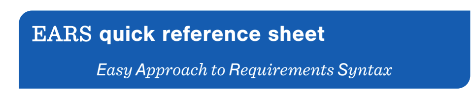
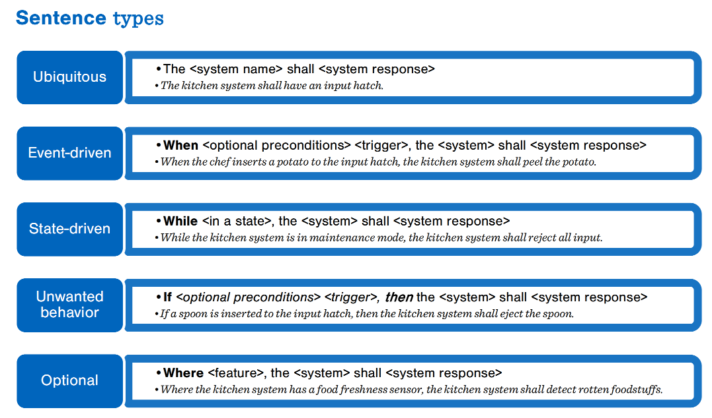
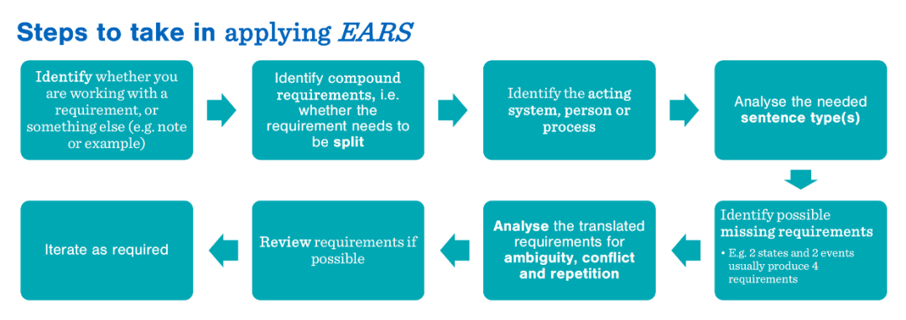
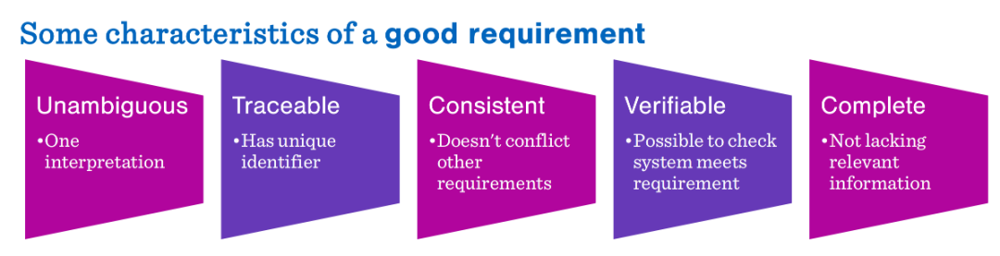
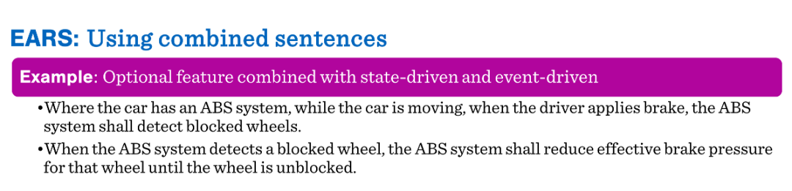
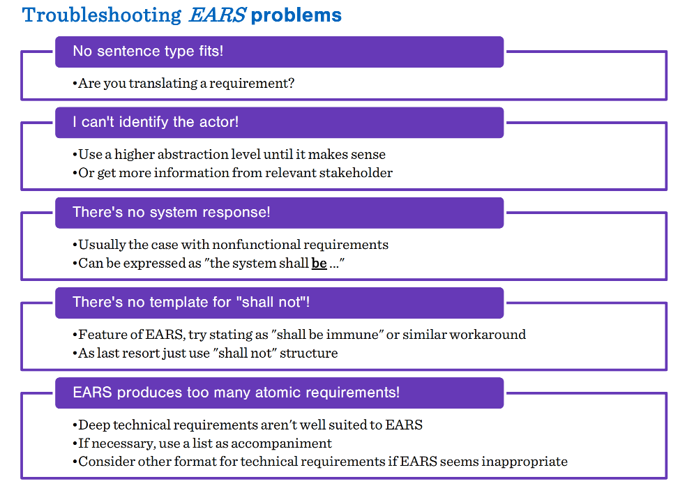
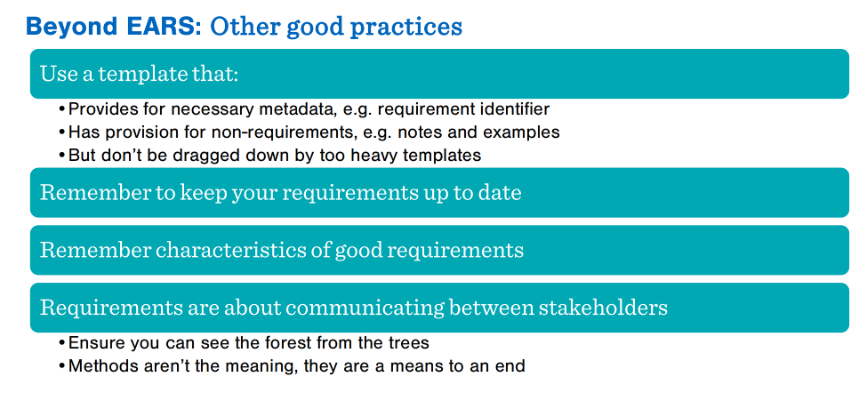

# SDD来了，产品经理怎么写出AI易读的SPEC-一起看下EARS给出的答案

最近 AI 辅助编程很火，说实话，单兵作战的时候写个小工具 不需要持续迭代的时候，这种氛围感确实能骗过自己的大脑，获得抽卡的多巴胺快感；但一旦你尝试在规模化团队里推行 SDD，引入 AI 协作，你会发现这种模糊性就是所有灾难的源头。

AI 辅助编程的上限，从来不在于大模型的智商，而在于你给出的 Spec 是否足够清晰。

产品经理，你准备好了吗？

没有的话，开发同学就只能自己撸袖子，充当那个从墨刀原型到AI可读spec的翻译官了。但这个翻译后的语义，是你想要的吗？

那怎么才能有一个团队共识的spec，作为工程化、可持续迭代，多方协作的基准？

EARS给了一个参考模板，我们一起读一下。

这份文件是《EARS 速查卡》，一份关于“简易需求语法”的快速参考指南。

首先，什么是EARS

EARS 是一种结构化需求描述的方法，其核心是使用不同类型的句式模板来清晰地定义系统功能。

文档的主要内容如下：

## PART1\. 句式类型

# 

EARS 的五种核心句式，每种都配有通用模板和示例：

- **普适性**：描述系统始终应具备的功能。
  - 模板：The <> shall <>
  - 举例：
    - The kitchen system shall have an input hatch.
    - CRM系统应该具备线索管理功能。
- **事件驱动**：描述在特定触发条件下系统的响应。
  - 模板：When <> , the <> shall <> 。
  - 举例：
    - When the chef inserts a potato to the input hatch, the kitchen system shall peel the potato.
    - 当用户在APP点击领取优惠券时，线索应当被创建。
- **状态驱动**：描述当系统处于特定状态时应表现的行为。
  - 模板：While <> , the <>shall <> 。
  - 举例：
    - While the kitchen system is in maintenance mode, the kitchen system shall reject all input.
    - 当线索未及时跟进即将回流时，系统应当通知线索责任人发送提醒。
- **反行为**：描述在特定条件下系统应防止或处理的错误/异常行为。
  - 模板：If  <>, then  <>the  <>shall  <>。
  - 举例：
    - If a spoon is inserted to the input hatch, then the kitchen system shall eject the spoon.
    - 如果线索创建时未指定是属于哪个产线，则为之设置为默认产线。
- **可选功能**：描述在系统具备某个可选特性时才应提供的功能。
  - 模板：Where  <> , the  <>shall  <>。
  - 举例：
    - Where the kitchen system has a food freshness sensor, the kitchen system shall detect rotten foodstuffs.
    - 如果线索属于协同做功，则用户活跃时同时通知责任人和协办人。

## PART2\. 应用EARS的步骤

应用EARS方法的步骤

- **辨别属性** ：识别你处理的是“需求”，还是其他信息（如注释或示例）。
- **识别复合需求** ：判断需求是否需要拆分（即原子化）。
- **确定主体** ：识别执行动作的系统、人或流程。
- **分析句式** ：分析所需的句子类型。
- **查漏补缺** ：识别可能遗漏的需求（例如：2个状态和2个事件通常会产生4条需求）。
- **消除歧义** ：分析翻译后的需求是否存在歧义、冲突或重复。
- **评审与迭代** ：尽可能评审需求并根据需要进行迭代。

## PART3. 优秀需求的特征

# 

- **可追溯 (Traceable)** ：拥有唯一标识符。
- **一致性 (Consistent)** ：不与其他需求冲突。
- **可验证 (Verifiable)** ：可以检查系统是否满足该要求。
- **无歧义 (Unambiguous)** ：只有一种解释。
- **完整性 (Complete)** ：不缺失相关信息。

## PART4\. 组合句式

# 

当可选性、状态与事件相互嵌套时，可以应用组合句式，实现复杂系统逻辑描述。

在有 ABS 系统的情况下（可选），当车辆处于行驶状态时（状态），一旦驾驶员踩下刹车（事件），ABS 系统应检测车轮抱死情况 。（多维约束案例）

当 ABS 系统检测到车轮抱死时，ABS 系统应降低该轮的有效制动压力，直到车轮解除抱死 。（逻辑闭环案例）

## PART5. 避坑指南

# 

- **找不到匹配句型？**
先反思你是否真的在写“需求” 。

- **无法识别执行主体？**
向上提升抽象层次，或找核心干系人补齐上下文 。

- **没有明显的系统响应？**
常出现在非功能性需求中，可表述为“系统应保持...状态” 。

- **没有“严禁 (Shall not)”模板？**
EARS 鼓励正面表述（如“应免疫于...”），万不得已再用“不应” 。

- **原子需求爆炸？**
深度技术细节可能不适配 EARS，建议配合列表或换用其他技术格式 。

## PART6. 超越EARS

# 

- **元数据管理**  
使用提供 ID 和注释空间的模板，但不要被沉重的模板拖累 。

- **见林也见木**  
需求是为了在干系人之间建立共识 。

- **回归本质**  
记住，方法只是手段，交付价值才是目的 。

## 最后 

为什么我要在这个时间节点，重新翻出 EARS (Easy Approach to Requirements Syntax) 。它不是在教我们八股文，它是在给你的逻辑建“模具”（元逻辑框架，你可以理解成是AI时代产品经理的金字塔原理）。

在 AI 协作的语境下，Spec 的清晰度直接决定了你是个“架构师”还是个“画原型的”。如果你不能用这几套模板把系统响应“格式化”，你就永远停留在产品原型的皮毛上，没法真正触达逻辑架构的深层。  

那个翻译官的权限，拱手让给了愿意左移的研发同学，那么环节是不是还可以更少一些，为什么需要从 业务需求-产品原型方案 - AI readable SPEC，而不是直接的 业务需求-SPEC, 减少中间商赚差价，不香吗？

可以说，EARS 是 PO（产品负责人）从感性原型向理性逻辑进阶的必经之路。

EARS 这种看似死板的填空，其实是 PO 强制性自我逻辑重组的过程。它把你从那种“想当然”的感性状态里拎出来，扔进严丝合缝的逻辑框架。只有当你给出的需求是确定的，生成的 SDD 才有锚点，AI 辅助编程才不会变成一场昂贵的“抓瞎”。

为了中间商存在的意义，产品同学，我们一起自勉，从今天开始，把逻辑从墨刀的备注框里，挪到markdown的spec里吧!

\- 关注我，发送消息EARS，原文件发你-