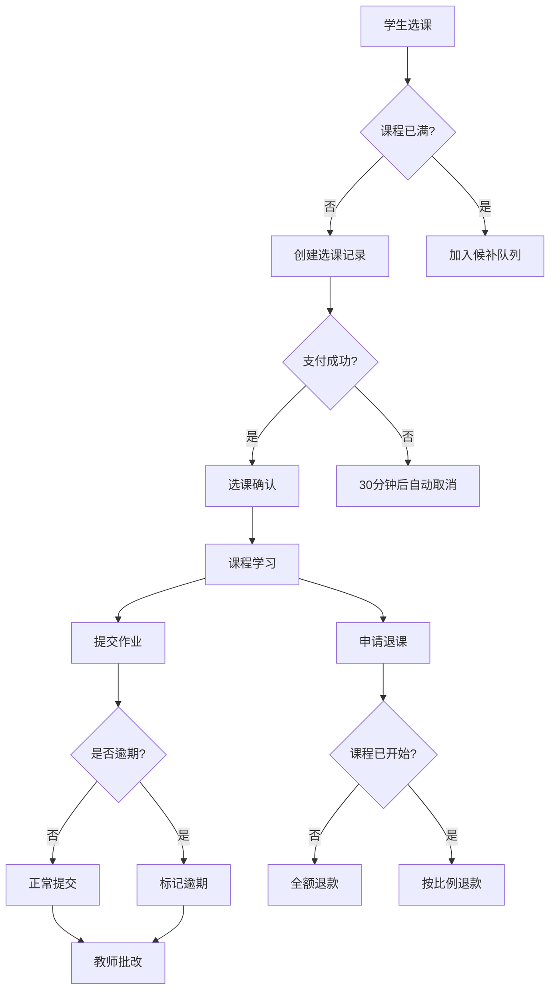

# 在线教育系统 PRD

## 1. 文档信息
- **版本**: v1.0
- **日期**: 2026-04-12
- **作者**: AI Assistant
- **状态**: 已批准

## 2. 背景与目标
构建一个在线教育系统，支持学生选课、课程进度跟踪、作业提交与批改等核心功能，确保教学流程顺畅并覆盖各类边界情况。

## 3. 全局名词定义 (Glossary)

| 术语 | 定义 | 取值范围/示例 |
|:---|:---|:---|
| **Student** | 已注册并处于 Active 状态的学生用户 | - |
| **Course** | 系统提供的课程资源 | - |
| **CourseStatus** | 课程当前状态 | [Draft, Published, Full, InProgress, Completed, Cancelled] |
| **Enrollment** | 学生选课记录 | - |
| **EnrollmentStatus** | 选课状态 | [Pending, Confirmed, InProgress, Completed, Dropped] |
| **Assignment** | 课程作业 | - |
| **AssignmentStatus** | 作业状态 | [NotStarted, InProgress, Submitted, Graded, Overdue] |
| **Submission** | 学生作业提交记录 | - |

## 4. 非功能性需求 (NFRs)

| Req ID | 模式 | 需求描述 |
|:---|:---|:---|
| NFR-001 | Ubiquitous | 系统所有敏感数据传输应当采用加密方式 |
| NFR-002 | Ubiquitous | 系统应当支持每秒至少 1000 次并发请求 |
| NFR-003 | Ubiquitous | 系统应当保证 99.9% 的服务可用性 |
| NFR-004 | Ubiquitous | 系统应当保存所有操作日志至少 180 天 |

## 5. 功能性需求 (EARS Requirements)

### 5.1 选课模块

| Req ID | 模式 | 需求描述 |
|:---|:---|:---|
| REQ-001 | When | **When** 学生浏览课程列表时，系统应当显示所有 Published 状态的课程 |
| REQ-002 | When | **When** 学生点击"选课"按钮时，系统应当检查课程是否已满 |
| REQ-003 | If | **If** 课程状态为 Full，则系统应当提示"课程已满"并询问是否加入候补 |
| REQ-004 | When | **When** 学生选择加入候补时，系统应当将其加入候补队列并按顺序通知 |
| REQ-005 | When | **When** 学生成功选课时，系统应当创建 Enrollment 记录并扣减课程名额 |
| REQ-006 | If | **If** 学生已选该课程，则系统应当提示"已选此课程"并阻止重复选课 |
| REQ-007 | If | **If** 学生选课时间与已选其他课程时间冲突，则系统应当提示时间冲突 |
| REQ-008 | While | **While** 选课处于 Pending 状态期间，系统应当保留名额 30 分钟并要求完成支付 |
| REQ-009 | If | **If** 选课后 30 分钟内未完成支付，则系统应当自动取消选课并释放名额 |

### 5.2 退课模块

| Req ID | 模式 | 需求描述 |
|:---|:---|:---|
| REQ-010 | When | **When** 学生在课程开始前申请退课时，系统应当批准退课并全额退款 |
| REQ-011 | If | **If** 学生在课程开始后申请退课，则系统应当按照已上课时比例计算退款 |
| REQ-012 | If | **If** 学生退课时已产生作业提交记录，则系统应当保留作业历史但不计入成绩 |
| REQ-013 | While | **While** 退课申请处理期间，系统应当暂停该学生的课程访问权限 |
| REQ-014 | Complex | **While** 课程已完成 50% 以上，**When** 学生申请退课时，系统应当提示可能无法退款 |

### 5.3 课程进度跟踪模块

| Req ID | 模式 | 需求描述 |
|:---|:---|:---|
| REQ-015 | When | **When** 学生完成课程章节学习时，系统应当记录学习进度并解锁下一章节 |
| REQ-016 | When | **When** 学生观看视频达到 90% 时，系统应当标记该章节为已完成 |
| REQ-017 | While | **While** 课程处于 InProgress 状态期间，系统应当实时更新学习进度百分比 |
| REQ-018 | While | **While** 学生处于学习过程中，系统应当每 5 分钟自动保存学习位置 |
| REQ-019 | If | **If** 网络中断导致进度保存失败，则系统应当在恢复后自动重试保存 |

### 5.4 作业提交与批改模块

| Req ID | 模式 | 需求描述 |
|:---|:---|:---|
| REQ-020 | When | **When** 教师发布作业时，系统应当通知所有选课学生并设置截止时间 |
| REQ-021 | When | **When** 学生提交作业时，系统应当验证文件格式和大小 |
| REQ-022 | If | **If** 提交文件格式不符合要求，则系统应当提示"格式错误"并拒绝提交 |
| REQ-023 | If | **If** 提交文件超过大小限制，则系统应当提示"文件过大"并拒绝提交 |
| REQ-024 | While | **While** 作业处于 Submitted 状态期间，系统应当允许学生在截止前重新提交 |
| REQ-025 | If | **If** 学生提交时间晚于截止时间，则系统应当标记为 Overdue 并按迟交规则扣分 |
| REQ-026 | When | **When** 教师批改作业时，系统应当记录分数和评语 |
| REQ-027 | When | **When** 作业批改完成后，系统应当通知学生并开放成绩查看 |
| REQ-028 | If | **If** 教师在学生提交后 7 天内未完成批改，则系统应当提醒教师尽快批改 |
| REQ-029 | Complex | **While** 作业已截止，**When** 学生申请延期时，系统应当转交教师审批 |

### 5.5 课程满员处理模块

| Req ID | 模式 | 需求描述 |
|:---|:---|:---|
| REQ-030 | When | **When** 课程名额达到上限时，系统应当将课程状态更新为 Full |
| REQ-031 | When | **When** 有学生退课时，系统应当按候补顺序通知第一位候补学生 |
| REQ-032 | When | **When** 候补学生在 24 小时内确认选课时，系统应当将其转为正式选课 |
| REQ-033 | If | **If** 候补学生 24 小时内未确认，则系统应当通知下一位候补学生 |
| REQ-034 | While | **While** 学生处于候补状态时，系统应当允许其随时取消候补 |

## 6. 组合覆盖度矩阵

### 6.1 选课状态 × 事件

| 状态 \ 事件 | 选课 | 支付成功 | 支付超时 | 退课 | 课程开始 | 课程完成 |
|:---|:---:|:---:|:---:|:---:|:---:|:---:|
| Pending | ✅ REQ-002 | ✅ REQ-005 | ✅ REQ-009 | - | - | - |
| Confirmed | - | - | - | ✅ REQ-010 | ✅ REQ-017 | - |
| InProgress | - | - | - | ✅ REQ-011 | - | ✅ REQ-017 |
| Completed | - | - | - | - | - | - |
| Dropped | - | - | - | - | - | - |

### 6.2 作业状态 × 事件

| 状态 \ 事件 | 提交作业 | 重新提交 | 截止 | 教师批改 | 申请延期 |
|:---|:---:|:---:|:---:|:---:|:---:|
| NotStarted | ✅ REQ-021 | - | - | - | - |
| InProgress | ✅ REQ-021 | - | ✅ REQ-025 | - | - |
| Submitted | - | ✅ REQ-024 | ✅ REQ-025 | ✅ REQ-026 | ✅ REQ-029 |
| Graded | - | - | - | - | - |
| Overdue | - | - | - | ✅ REQ-026 | ✅ REQ-029 |

## 7. 业务流程图

## 8. 需求追溯矩阵

| 需求 ID | 相关业务目标 | 优先级 |
|:---|:---|:---:|
| REQ-001 ~ REQ-009 | 支持学生顺利选课 | P0 |
| REQ-010 ~ REQ-014 | 支持灵活退课机制 | P1 |
| REQ-015 ~ REQ-019 | 实现学习进度跟踪 | P0 |
| REQ-020 ~ REQ-029 | 完成作业提交与批改闭环 | P0 |
| REQ-030 ~ REQ-034 | 处理课程满员与候补 | P1 |
