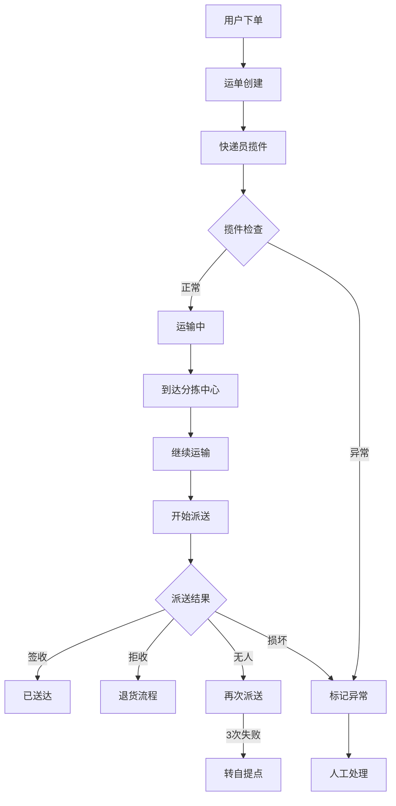

# 物流追踪系统 PRD

## 1. 文档信息
- **版本**: v1.0
- **日期**: 2026-04-12
- **作者**: AI Assistant
- **状态**: 已批准

## 2. 背景与目标
构建一个物流追踪系统，支持运单全生命周期管理，包括揽件、运输、派送、签收等核心流程，并妥善处理包裹丢失、运输延误、用户拒收等异常情况。

## 3. 全局名词定义 (Glossary)

| 术语 | 定义 | 取值范围/示例 |
|:---|:---|:---|
| **Waybill** | 物流运单 | - |
| **WaybillStatus** | 运单当前状态 | [Created, PickedUp, InTransit, AtHub, OutForDelivery, Delivered, Exception, Returned] |
| **Courier** | 负责揽件和派送的快递员 | - |
| **TrackingEvent** | 物流跟踪事件 | - |
| **DeliveryException** | 派送异常类型 | [AddressIssue, RecipientUnavailable, Damaged, Refused, Lost, Delay] |
| **Route** | 运输路线 | - |
| **Hub** | 分拣中心 | - |

## 4. 非功能性需求 (NFRs)

| Req ID | 模式 | 需求描述 |
|:---|:---|:---|
| NFR-001 | Ubiquitous | 系统应当保证运单信息实时同步，延迟不超过 5 秒 |
| NFR-002 | Ubiquitous | 系统应当支持每日至少 100 万单的处理能力 |
| NFR-003 | Ubiquitous | 系统应当保存运单历史记录至少 2 年 |
| NFR-004 | Ubiquitous | 系统应当提供 7×24 小时服务可用性 |

## 5. 功能性需求 (EARS Requirements)

### 5.1 运单创建与揽件模块

| Req ID | 模式 | 需求描述 |
|:---|:---|:---|
| REQ-001 | When | **When** 用户下单时，系统应当创建运单并将状态设置为 Created |
| REQ-002 | When | **When** 快递员接单时，系统应当记录快递员信息并通知用户 |
| REQ-003 | When | **When** 快递员完成揽件扫描时，系统应当将运单状态更新为 PickedUp |
| REQ-004 | If | **If** 揽件时发现包裹破损，则系统应当标记异常并拍照记录 |
| REQ-005 | If | **If** 用户取消订单时运单已创建，则系统应当标记运单为 Cancelled |
| REQ-006 | While | **While** 运单处于 Created 状态期间，系统应当允许用户修改收件信息 |

### 5.2 运输跟踪模块

| Req ID | 模式 | 需求描述 |
|:---|:---|:---|
| REQ-007 | When | **When** 运单到达分拣中心时，系统应当记录入库时间并更新状态为 AtHub |
| REQ-008 | When | **When** 运单完成分拣并装车时，系统应当更新状态为 InTransit |
| REQ-009 | When | **When** 运单到达中转站时，系统应当记录位置并更新跟踪信息 |
| REQ-010 | While | **While** 运单处于 InTransit 状态期间，系统应当每 30 分钟更新一次位置 |
| REQ-011 | If | **If** 运单在途超过预计时间 24 小时无更新，则系统应当触发延误预警 |
| REQ-012 | If | **If** 运单在运输过程中丢失，则系统应当标记为 Exception 并启动理赔流程 |
| REQ-013 | Complex | **While** 运单处于 AtHub 状态下，**If** 分拣超时 4 小时，则系统应当触发异常预警 |

### 5.3 派送与签收模块

| Req ID | 模式 | 需求描述 |
|:---|:---|:---|
| REQ-014 | When | **When** 快递员开始派送时，系统应当将状态更新为 OutForDelivery |
| REQ-015 | When | **When** 快递员开始派送时，系统应当通知收件人准备签收 |
| REQ-016 | When | **When** 收件人签收时，系统应当记录签收时间并将状态更新为 Delivered |
| REQ-017 | If | **If** 派送时收件人不在且无法联系，则系统应当标记为 RecipientUnavailable |
| REQ-018 | If | **If** 派送时收件人拒收包裹，则系统应当标记为 Refused 并启动退货流程 |
| REQ-019 | If | **If** 派送时发现包裹损坏，则系统应当标记为 Damaged 并记录证据 |
| REQ-020 | If | **If** 派送地址错误导致无法送达，则系统应当标记为 AddressIssue |
| REQ-021 | While | **While** 运单处于 OutForDelivery 状态期间，系统应当允许用户修改派送时间 |
| REQ-022 | Complex | **While** 运单处于 OutForDelivery 状态下，**If** 连续 3 次派送失败，则系统应当转为自提点代收 |
| REQ-023 | When | **When** 用户选择自提点代收时，系统应当更新派送地址为最近自提点 |

### 5.4 异常处理模块

| Req ID | 模式 | 需求描述 |
|:---|:---|:---|
| REQ-024 | While | **While** 运单处于 Exception 状态期间，系统应当暂停自动流转并等待人工处理 |
| REQ-025 | When | **When** 人工确认异常处理方案后，系统应当按照方案执行 |
| REQ-026 | If | **If** 包裹确认丢失，则系统应当自动发起理赔流程并通知寄件人 |
| REQ-027 | If | **If** 运输延误超过 72 小时，则系统应当自动赔付延误费用 |
| REQ-028 | If | **If** 用户申请拦截包裹，则系统应当尝试在下一节点拦截 |
| REQ-029 | Complex | **While** 运单处于 Exception 状态下，**When** 用户申请改地址时，系统应当评估可行性 |

### 5.5 退货与退款模块

| Req ID | 模式 | 需求描述 |
|:---|:---|:---|
| REQ-030 | When | **When** 用户发起退货申请时，系统应当创建退货运单 |
| REQ-031 | When | **When** 退货包裹被揽收时，系统应当更新原订单为退货中 |
| REQ-032 | When | **When** 退货包裹送达商家后，系统应当通知商家验收 |
| REQ-033 | If | **If** 商家验收通过，则系统应当触发退款流程 |
| REQ-034 | If | **If** 商家验收不通过，则系统应当通知用户并协商处理 |
| REQ-035 | While | **While** 退货流程进行中，系统应当实时更新退货物流信息 |

## 6. 组合覆盖度矩阵

### 6.1 运单状态 × 事件

| 状态 \ 事件 | 创建 | 揽件 | 到达分拣中心 | 开始派送 | 签收 | 用户拒收 | 包裹丢失 |
|:---|:---:|:---:|:---:|:---:|:---:|:---:|:---:|
| Created | ✅ REQ-001 | ✅ REQ-003 | - | - | - | - | - |
| PickedUp | - | - | ✅ REQ-007 | - | - | - | ✅ REQ-012 |
| AtHub | - | - | - | - | - | - | ✅ REQ-012 |
| InTransit | - | - | ✅ REQ-009 | - | - | - | ✅ REQ-012 |
| OutForDelivery | - | - | - | ✅ REQ-014 | ✅ REQ-016 | ✅ REQ-018 | - |
| Delivered | - | - | - | - | - | - | - |
| Exception | - | - | - | - | - | - | - |
| Returned | - | - | - | - | - | - | - |

### 6.2 异常类型 × 处理事件

| 异常类型 \ 处理 | 人工介入 | 自动理赔 | 用户改派 | 转自提点 |
|:---|:---:|:---:|:---:|:---:|
| AddressIssue | ✅ REQ-025 | - | ✅ REQ-029 | - |
| RecipientUnavailable | ✅ REQ-025 | - | - | ✅ REQ-022 |
| Damaged | ✅ REQ-025 | ✅ REQ-026 | - | - |
| Refused | ✅ REQ-025 | - | - | - |
| Lost | ✅ REQ-025 | ✅ REQ-026 | - | - |
| Delay | - | ✅ REQ-027 | - | - |

## 7. 业务流程图

## 8. 需求追溯矩阵

| 需求 ID | 相关业务目标 | 优先级 |
|:---|:---|:---:|
| REQ-001 ~ REQ-006 | 运单创建与揽件流程 | P0 |
| REQ-007 ~ REQ-013 | 运输过程跟踪 | P0 |
| REQ-014 ~ REQ-023 | 派送与签收 | P0 |
| REQ-024 ~ REQ-029 | 异常情况处理 | P1 |
| REQ-030 ~ REQ-035 | 退货退款流程 | P1 |
