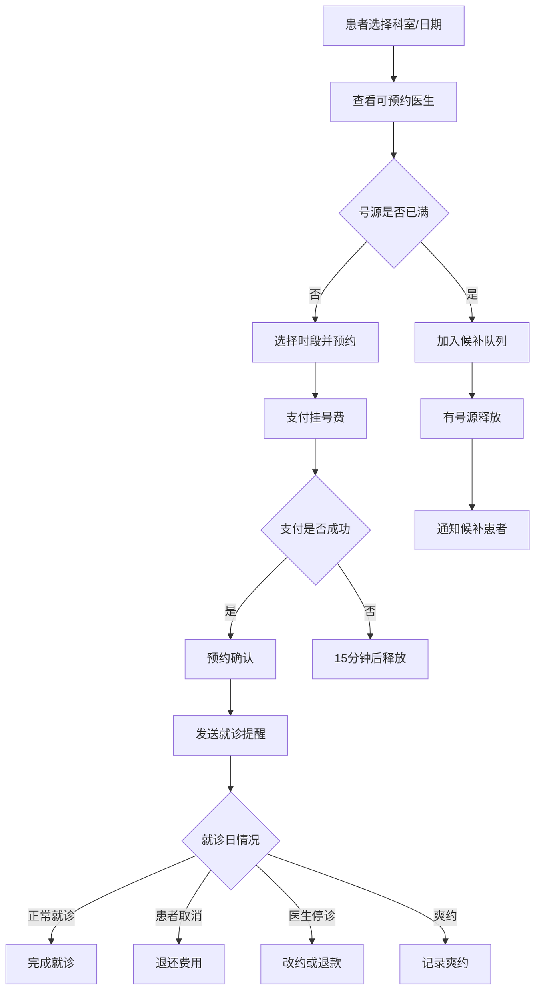

# 医院预约挂号系统 PRD

## 1. 文档信息
- **版本**: v1.0
- **日期**: 2026-04-12
- **作者**: AI Assistant
- **状态**: 已批准

## 2. 背景与目标
构建医院预约挂号系统，支持患者在线选择科室和医生、预约就诊时间、支付挂号费，并提供就诊前提醒功能。系统需妥善处理医生临时停诊、患者爽约、号源已满、重复预约等边界情况。

## 3. 全局名词定义 (Glossary)

| 术语 | 定义 | 取值范围/示例 |
|:---|:---|:---|
| **Patient** | 已注册的患者用户 | - |
| **Doctor** | 医院在职医生 | - |
| **Department** | 医院科室 | [内科, 外科, 儿科, 妇科, 骨科...] |
| **Appointment** | 患者预约挂号记录 | - |
| **AppointmentStatus** | 预约状态 | [Pending, Confirmed, Completed, Cancelled, NoShow, Expired] |
| **TimeSlot** | 号源时段 | 如：09:00-09:30 |
| **DoctorSchedule** | 医生排班信息 | - |
| **RegistrationFee** | 挂号费用 | - |
| **Waitlist** | 候补队列 | - |

## 4. 非功能性需求 (NFRs)

| Req ID | 模式 | 需求描述 |
|:---|:---|:---|
| NFR-001 | Ubiquitous | 系统应当支持每日至少 10 万次预约操作 |
| NFR-002 | Ubiquitous | 系统应当保证患者隐私数据加密存储 |
| NFR-003 | Ubiquitous | 系统应当提供 99.5% 的服务可用性 |
| NFR-004 | Ubiquitous | 系统应当保存预约记录至少 5 年 |
| NFR-005 | Ubiquitous | 系统应当支持高峰时段 5000 并发预约请求 |

## 5. 功能性需求 (EARS Requirements)

### 5.1 预约查询与选择模块

| Req ID | 模式 | 需求描述 |
|:---|:---|:---|
| REQ-001 | When | **When** 患者选择科室和日期时，系统应当显示可预约的医生列表 |
| REQ-002 | When | **When** 患者选择医生时，系统应当显示该医生的可用时段 |
| REQ-003 | When | **When** 患者查看医生信息时，系统应当显示医生专长和患者评价 |
| REQ-004 | If | **If** 所选日期该医生无排班，则系统应当推荐其他日期或同科室其他医生 |
| REQ-005 | If | **If** 所选时段号源已满，则系统应当提示"号源已满"并推荐其他时段 |
| REQ-006 | When | **When** 患者选择候补时，系统应当将其加入候补队列并按顺序通知 |
| REQ-007 | While | **While** 患者处于候补状态时，系统应当允许其随时取消候补 |

### 5.2 预约创建与支付模块

| Req ID | 模式 | 需求描述 |
|:---|:---|:---|
| REQ-008 | When | **When** 患者确认预约时，系统应当扣减号源并生成预约记录 |
| REQ-009 | If | **If** 预约时患者已有冲突时段的预约，则系统应当提示时间冲突 |
| REQ-010 | If | **If** 患者 30 天内累计 3 次爽约，则系统应当暂停其预约权限 7 天 |
| REQ-011 | When | **When** 患者完成挂号费支付时，系统应当将预约状态更新为 Confirmed |
| REQ-012 | If | **If** 患者 15 分钟内未完成支付，则系统应当自动释放号源 |
| REQ-013 | While | **While** 预约处于 Pending 状态期间，系统应当保留号源 15 分钟 |
| REQ-014 | Complex | **While** 患者处于预约限制期间，**When** 尝试预约时，系统应当提示限制原因和解禁时间 |

### 5.3 预约管理与提醒模块

| Req ID | 模式 | 需求描述 |
|:---|:---|:---|
| REQ-015 | While | **While** 预约处于 Confirmed 状态期间，系统应当保留号源并允许患者取消 |
| REQ-016 | When | **When** 就诊前 24 小时，系统应当发送就诊提醒通知 |
| REQ-017 | When | **When** 就诊前 2 小时，系统应当再次发送提醒并告知就诊地点 |
| REQ-018 | When | **When** 患者提前取消预约时，系统应当释放号源并原路退还挂号费 |
| REQ-019 | If | **If** 患者在就诊前 2 小时内取消，则系统应当不退还挂号费 |
| REQ-020 | Where | **Where** 医院配置了候诊提醒功能时，**When** 医生叫号时系统应当通知患者 |

### 5.4 医生停诊处理模块

| Req ID | 模式 | 需求描述 |
|:---|:---|:---|
| REQ-021 | When | **When** 医生临时停诊时，系统应当自动取消相关预约并通知患者 |
| REQ-022 | When | **When** 医生停诊通知患者时，系统应当提供改约或退款选项 |
| REQ-023 | If | **If** 患者选择改约，则系统应当优先安排该医生的其他时段 |
| REQ-024 | If | **If** 患者选择退款，则系统应当原路退还挂号费 |
| REQ-025 | Complex | **While** 预约已支付状态下，**When** 医生停诊时，系统应当自动全额退款 |

### 5.5 就诊完成与爽约处理模块

| Req ID | 模式 | 需求描述 |
|:---|:---|:---|
| REQ-026 | When | **When** 患者完成就诊时，系统应当将预约状态更新为 Completed |
| REQ-027 | If | **If** 患者未在预约时间就诊且未提前取消，则系统应当标记为 NoShow |
| REQ-028 | If | **If** 患者爽约，则系统应当记录爽约次数并影响信用评分 |
| REQ-029 | When | **When** 患者爽约后再次预约时，系统应当提示当前爽约次数 |
| REQ-030 | While | **While** 患者处于预约限制状态期间，系统应当不接受新的预约请求 |

### 5.6 号源管理与候补模块

| Req ID | 模式 | 需求描述 |
|:---|:---|:---|
| REQ-031 | When | **When** 有患者取消预约时，系统应当按候补顺序通知第一位候补患者 |
| REQ-032 | When | **When** 候补患者收到通知时，系统应当要求其在 30 分钟内确认 |
| REQ-033 | When | **When** 候补患者在 30 分钟内确认时，系统应当将其转为正式预约 |
| REQ-034 | If | **If** 候补患者 30 分钟内未确认，则系统应当通知下一位候补患者 |
| REQ-035 | If | **If** 候补队列中无患者响应，则系统应当释放号源至公开池 |

## 6. 组合覆盖度矩阵

### 6.1 预约状态 × 事件

| 状态 \ 事件 | 创建预约 | 支付成功 | 支付超时 | 患者取消 | 医生停诊 | 就诊完成 | 爽约 |
|:---|:---:|:---:|:---:|:---:|:---:|:---:|:---:|
| Pending | ✅ REQ-008 | ✅ REQ-011 | ✅ REQ-012 | ✅ REQ-018 | - | - | - |
| Confirmed | - | - | - | ✅ REQ-018 | ✅ REQ-021 | ✅ REQ-026 | ✅ REQ-027 |
| Completed | - | - | - | - | - | - | - |
| Cancelled | - | - | - | - | - | - | - |
| NoShow | - | - | - | - | - | - | - |
| Expired | - | - | - | - | - | - | - |

### 6.2 候补状态 × 事件

| 状态 \ 事件 | 加入候补 | 收到通知 | 确认候补 | 超时未确认 | 取消候补 |
|:---|:---:|:---:|:---:|:---:|:---:|
| Waitlisted | ✅ REQ-006 | ✅ REQ-031 | - | - | ✅ REQ-007 |
| Notified | - | - | ✅ REQ-033 | ✅ REQ-034 | - |
| Converted | - | - | - | - | - |
| Expired | - | - | - | - | - |

## 7. 业务流程图

## 8. 需求追溯矩阵

| 需求 ID | 相关业务目标 | 优先级 |
|:---|:---|:---:|
| REQ-001 ~ REQ-007 | 预约查询与选择 | P0 |
| REQ-008 ~ REQ-014 | 预约创建与支付 | P0 |
| REQ-015 ~ REQ-020 | 预约管理与提醒 | P0 |
| REQ-021 ~ REQ-025 | 医生停诊处理 | P1 |
| REQ-026 ~ REQ-030 | 就诊完成与爽约处理 | P1 |
| REQ-031 ~ REQ-035 | 号源管理与候补 | P1 |

## 9. 关键设计说明

### 9.1 If 与 When 的正确使用

本 PRD 严格遵循 EARS 规范中 If 句式的使用原则：**If 仅用于异常/不期望行为**。

**正确使用示例**：
- ✅ `If 所选时段号源已满` - 号源已满属于异常/不期望状态
- ✅ `If 患者 30 天内累计 3 次爽约` - 爽约属于异常行为
- ✅ `When 患者选择候补时` - 选择候补是正常业务流程，使用 When 而非 If

**关键纠正**：
- ❌ 误用：`If 患者选择候补，则系统应当...`
- ✅ 正确：`When 患者选择候补时，系统应当...`

### 9.2 技术实现隔离

本 PRD 不包含任何技术实现细节，如数据库、缓存、消息队列、API 设计等。所有需求均聚焦于业务逻辑和规则描述。
