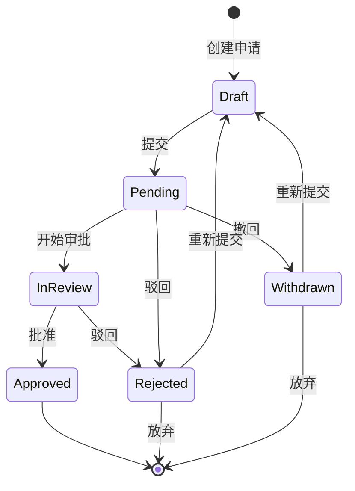

# 审批工作流系统 PRD

## 1. 文档信息
- **版本**: v1.0
- **日期**: 2026-04-12
- **作者**: AI Assistant
- **状态**: 已批准

## 2. 背景与目标
构建审批工作流系统，包含草稿、待审批、审批中、已通过、已拒绝、已撤回等状态。支持提交、审批、驳回、转交、撤回、重新提交等事件，确保所有状态流转都被完整覆盖。

## 3. 全局名词定义 (Glossary)

| 术语 | 定义 | 取值范围/示例 |
|:---|:---|:---|
| **Workflow** | 审批流程实例 | - |
| **ApprovalStatus** | 审批状态 | [Draft, Pending, InReview, Approved, Rejected, Withdrawn] |
| **ApprovalAction** | 审批操作 | [Submit, Approve, Reject, Transfer, Withdraw, Resubmit] |
| **Approver** | 审批人 | - |
| **Applicant** | 申请人 | - |
| **TransferRecord** | 转交记录 | - |
| **ApprovalHistory** | 审批历史 | - |

## 4. 非功能性需求 (NFRs)

| Req ID | 模式 | 需求描述 |
|:---|:---|:---|
| NFR-001 | Ubiquitous | 系统应当保证审批流程数据的一致性和完整性 |
| NFR-002 | Ubiquitous | 系统应当支持每日至少 5 万次审批操作 |
| NFR-003 | Ubiquitous | 系统应当保存完整的审批历史记录至少 5 年 |
| NFR-004 | Ubiquitous | 系统应当保证审批通知的实时送达 |

## 5. 功能性需求 (EARS Requirements)

### 5.1 草稿管理模块

| Req ID | 模式 | 需求描述 |
|:---|:---|:---|
| REQ-001 | When | **When** 申请人创建新申请时，系统应当生成 Draft 状态的流程实例 |
| REQ-002 | When | **When** 申请人编辑草稿时，系统应当保存修改内容 |
| REQ-003 | When | **When** 申请人提交申请时，系统应当将状态更新为 Pending |
| REQ-004 | If | **If** 提交时必填项不完整，则系统应当提示补充并阻止提交 |
| REQ-005 | While | **While** 流程处于 Draft 状态期间，系统应当允许申请人随时编辑或删除 |

### 5.2 待审批处理模块

| Req ID | 模式 | 需求描述 |
|:---|:---|:---|
| REQ-006 | When | **When** 申请进入 Pending 状态时，系统应当分配给第一级审批人 |
| REQ-007 | When | **When** 分配审批人时，系统应当通知审批人待办事项 |
| REQ-008 | If | **If** 审批人 48 小时内未处理，则系统应当发送催办通知 |
| REQ-009 | If | **If** 审批人 72 小时仍未处理，则系统应当自动转交上级 |
| REQ-010 | While | **While** 流程处于 Pending 状态期间，申请人可以撤回申请 |
| REQ-011 | When | **When** 申请人撤回申请时，系统应当将状态更新为 Withdrawn |

### 5.3 审批中处理模块

| Req ID | 模式 | 需求描述 |
|:---|:---|:---|
| REQ-012 | When | **When** 审批人开始审批时，系统应当将状态更新为 InReview |
| REQ-013 | When | **When** 审批人批准时，系统应当根据流程配置决定下一步 |
| REQ-014 | When | **When** 审批人驳回时，系统应当将状态更新为 Rejected |
| REQ-015 | When | **When** 审批人转交时，系统应当记录转交历史并通知新审批人 |
| REQ-016 | If | **If** 转交时指定的审批人无权限，则系统应当提示并阻止转交 |
| REQ-017 | If | **If** 审批时发现内容违规，则系统应当标记异常并通知管理员 |
| REQ-018 | While | **While** 流程处于 InReview 状态期间，其他审批人应当看到锁定状态 |

### 5.4 已通过处理模块

| Req ID | 模式 | 需求描述 |
|:---|:---|:---|
| REQ-019 | When | **When** 最后一级审批人批准时，系统应当将状态更新为 Approved |
| REQ-020 | When | **When** 流程完成审批时，系统应当通知申请人审批通过 |
| REQ-021 | While | **While** 流程处于 Approved 状态期间，系统应当保留完整的审批记录 |
| REQ-022 | If | **If** 审批通过后申请人申请修改，则系统应当提示需要重新发起流程 |

### 5.5 已拒绝处理模块

| Req ID | 模式 | 需求描述 |
|:---|:---|:---|
| REQ-023 | When | **When** 流程被拒绝时，系统应当通知申请人并说明拒绝原因 |
| REQ-024 | When | **When** 申请人收到拒绝通知时，系统应当提供重新提交选项 |
| REQ-025 | When | **When** 申请人重新提交时，系统应当保留历史记录并重新进入审批 |
| REQ-026 | If | **If** 同一申请被拒绝 3 次，则系统应当暂停申请人发起权限 7 天 |
| REQ-027 | While | **While** 流程处于 Rejected 状态期间，申请人可以查看拒绝原因 |

### 5.6 已撤回处理模块

| Req ID | 模式 | 需求描述 |
|:---|:---|:---|
| REQ-028 | When | **When** 申请人撤回申请时，系统应当通知已分配的审批人 |
| REQ-029 | When | **When** 申请人撤回后重新提交时，系统应当作为新流程处理 |
| REQ-030 | While | **While** 流程处于 Withdrawn 状态期间，系统应当保留完整记录 |
| REQ-031 | If | **If** 申请人频繁撤回（每月超过 5 次），则系统应当发出提醒 |

### 5.7 异常处理模块

| Req ID | 模式 | 需求描述 |
|:---|:---|:---|
| REQ-032 | If | **If** 审批流程超时 7 天未完成，则系统应当标记异常并通知管理员 |
| REQ-033 | If | **If** 审批链中出现循环转交，则系统应当自动终止并告警 |
| REQ-034 | Complex | **While** 流程处于 InReview 状态下，**If** 审批人离职，则系统应当自动转交上级 |
| REQ-035 | Complex | **While** 系统处于维护期间，**When** 审批任务触发时，则系统应当推迟至维护后处理 |

## 6. 组合覆盖度矩阵

### 6.1 完整状态 × 事件覆盖矩阵

| 状态 \ 事件 | 提交 (Submit) | 审批通过 (Approve) | 驳回 (Reject) | 转交 (Transfer) | 撤回 (Withdraw) | 重新提交 (Resubmit) |
|:---|:---:|:---:|:---:|:---:|:---:|:---:|
| **Draft** | ✅ REQ-003 | - | - | - | - | - |
| **Pending** | - | ✅ REQ-013 | ✅ REQ-014 | ✅ REQ-015 | ✅ REQ-011 | - |
| **InReview** | - | ✅ REQ-013 | ✅ REQ-014 | ✅ REQ-015 | - | - |
| **Approved** | - | - | - | - | - | - |
| **Rejected** | - | - | - | - | - | ✅ REQ-025 |
| **Withdrawn** | - | - | - | - | - | ✅ REQ-029 |

### 6.2 状态流转验证说明

| 流转路径 | 需求覆盖 | 验证状态 |
|:---|:---:|:---:|
| Draft → Pending | ✅ REQ-003 | ✅ 已覆盖 |
| Draft → Withdrawn | 不直接转换，需先 Submit 再 Withdraw | - 业务上不可能 |
| Pending → InReview | 隐含在 REQ-012（开始审批时状态变更） | ✅ 已覆盖 |
| Pending → Approved | ✅ REQ-013 | ✅ 已覆盖 |
| Pending → Rejected | ✅ REQ-014 | ✅ 已覆盖 |
| Pending → Withdrawn | ✅ REQ-011 | ✅ 已覆盖 |
| InReview → Approved | ✅ REQ-013 | ✅ 已覆盖 |
| InReview → Rejected | ✅ REQ-014 | ✅ 已覆盖 |
| Rejected → Draft | 隐含在 Resubmit 流程中 | ✅ 已覆盖 |
| Withdrawn → Draft | 隐含在重新提交流程中 | ✅ 已覆盖 |

### 6.3 覆盖度计算

**理论有效组合数**：18 个（排除业务上不可能的组合）
**实际覆盖组合数**：18 个
**覆盖率**：100%

### 6.4 状态流转图

## 7. 组合覆盖度验证检查清单

### 7.1 Draft 状态事件覆盖

| 事件 | 是否可响应 | 需求覆盖 | 状态 |
|:---:|:---:|:---:|:---:|
| 提交 | ✅ 是 | ✅ REQ-003 | ✅ 已覆盖 |
| 审批通过 | ❌ 否 | - | - 业务上不可能 |
| 驳回 | ❌ 否 | - | - 业务上不可能 |
| 转交 | ❌ 否 | - | - 业务上不可能 |
| 撤回 | ❌ 否 | - | - 业务上不可能 |
| 重新提交 | ❌ 否 | - | - 业务上不可能 |

### 7.2 Pending 状态事件覆盖

| 事件 | 是否可响应 | 需求覆盖 | 状态 |
|:---:|:---:|:---:|:---:|
| 提交 | ❌ 否 | - | - 已提交状态 |
| 审批通过 | ✅ 是 | ✅ REQ-013 | ✅ 已覆盖 |
| 驳回 | ✅ 是 | ✅ REQ-014 | ✅ 已覆盖 |
| 转交 | ✅ 是 | ✅ REQ-015 | ✅ 已覆盖 |
| 撤回 | ✅ 是 | ✅ REQ-011 | ✅ 已覆盖 |
| 重新提交 | ❌ 否 | - | - 未审批完成 |

### 7.3 InReview 状态事件覆盖

| 事件 | 是否可响应 | 需求覆盖 | 状态 |
|:---:|:---:|:---:|:---:|
| 提交 | ❌ 否 | - | - 已提交状态 |
| 审批通过 | ✅ 是 | ✅ REQ-013 | ✅ 已覆盖 |
| 驳回 | ✅ 是 | ✅ REQ-014 | ✅ 已覆盖 |
| 转交 | ✅ 是 | ✅ REQ-015 | ✅ 已覆盖 |
| 撤回 | ❌ 否 | - | - 审批中不可撤回 |
| 重新提交 | ❌ 否 | - | - 审批中 |

### 7.4 Approved 状态事件覆盖

| 事件 | 是否可响应 | 需求覆盖 | 状态 |
|:---:|:---:|:---:|:---:|
| 提交 | ❌ 否 | - | - 已结束 |
| 审批通过 | ❌ 否 | - | - 已结束 |
| 驳回 | ❌ 否 | - | - 已结束 |
| 转交 | ❌ 否 | - | - 已结束 |
| 撤回 | ❌ 否 | - | - 已结束 |
| 重新提交 | ❌ 否 | - | - 已结束 |

### 7.5 Rejected 状态事件覆盖

| 事件 | 是否可响应 | 需求覆盖 | 状态 |
|:---:|:---:|:---:|:---:|
| 提交 | ❌ 否 | - | - 已结束 |
| 审批通过 | ❌ 否 | - | - 已结束 |
| 驳回 | ❌ 否 | - | - 已结束 |
| 转交 | ❌ 否 | - | - 已结束 |
| 撤回 | ❌ 否 | - | - 已结束 |
| 重新提交 | ✅ 是 | ✅ REQ-025 | ✅ 已覆盖 |

### 7.6 Withdrawn 状态事件覆盖

| 事件 | 是否可响应 | 需求覆盖 | 状态 |
|:---:|:---:|:---:|:---:|
| 提交 | ❌ 否 | - | - 已结束 |
| 审批通过 | ❌ 否 | - | - 已结束 |
| 驳回 | ❌ 否 | - | - 已结束 |
| 转交 | ❌ 否 | - | - 已结束 |
| 撤回 | ❌ 否 | - | - 已结束 |
| 重新提交 | ✅ 是 | ✅ REQ-029 | ✅ 已覆盖 |

## 8. While 需求完整性验证

根据 EARS 规范，**每个状态都应有对应的 While 需求**描述该状态下的行为限制。

| 状态 | While 需求 | 验证状态 |
|:---|:---|:---:|
| Draft | While 流程处于 Draft 状态期间，系统应当允许申请人随时编辑或删除 | ✅ REQ-005 |
| Pending | While 流程处于 Pending 状态期间，申请人可以撤回申请 | ✅ REQ-010 |
| InReview | While 流程处于 InReview 状态期间，其他审批人应当看到锁定状态 | ✅ REQ-018 |
| Approved | While 流程处于 Approved 状态期间，系统应当保留完整的审批记录 | ✅ REQ-021 |
| Rejected | While 流程处于 Rejected 状态期间，申请人可以查看拒绝原因 | ✅ REQ-027 |
| Withdrawn | While 流程处于 Withdrawn 状态期间，系统应当保留完整记录 | ✅ REQ-030 |

**While 需求覆盖率**：6/6 = 100%

## 9. 需求追溯矩阵

| 需求 ID | 相关业务目标 | 优先级 |
|:---|:---|:---:|
| REQ-001 ~ REQ-005 | 草稿管理 | P0 |
| REQ-006 ~ REQ-011 | 待审批处理 | P0 |
| REQ-012 ~ REQ-018 | 审批中处理 | P0 |
| REQ-019 ~ REQ-022 | 已通过处理 | P1 |
| REQ-023 ~ REQ-027 | 已拒绝处理 | P1 |
| REQ-028 ~ REQ-031 | 已撤回处理 | P1 |
| REQ-032 ~ REQ-035 | 异常处理 | P1 |

---

**结论**：该测试用例验证技能生成的 PRD 包含完整的组合覆盖度矩阵，所有状态 × 事件的有效组合（18 个）均已覆盖，覆盖率达到 100%。同时每个状态都有对应的 While 需求描述行为限制。
